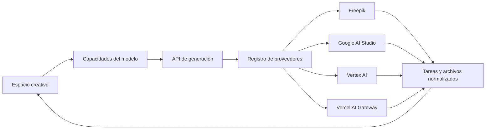

<div align="center">
  

  # Open-Higgsfield

  **La alternativa open source y multiproveedor a Higgsfield para generar imágenes y videos con IA.**

  Genera con modelos de Freepik, Gemini, Google Vertex AI y Vercel AI Gateway desde un único estudio creativo.

  <p>
    <a href="https://openhiggs.techbe.me"><strong>Demo en vivo</strong></a>
    |
    <a href="#por-qué-open-higgsfield">Funciones</a>
    |
    <a href="#proveedores-compatibles">Proveedores</a>
    |
    <a href="#inicio-rápido">Inicio rápido</a>
    |
    <a href="CONTRIBUTING.md">Contribuir</a>
  </p>

  <p>
    <a href="https://github.com/TechBeme/open-higgsfield/actions/workflows/ci.yml"></a>
    <a href="LICENSE"></a>
    <a href="https://nextjs.org"></a>
    <a href="https://www.typescriptlang.org"></a>
    <a href="https://github.com/TechBeme/open-higgsfield/stargazers"></a>
  </p>

  **Idiomas:** [🇺🇸 English](README.md) · [🇧🇷 Português](README.pt-BR.md) · 🇪🇸 Español

  <p>
    <a href="https://vercel.com/new/clone?repository-url=https%3A%2F%2Fgithub.com%2FTechBeme%2Fopen-higgsfield"></a>
  </p>
</div>


## ¿Por qué Open-Higgsfield?

Los modelos de medios generativos están repartidos entre proveedores, paneles y controles incompatibles. Open-Higgsfield los reúne en un único espacio visual:

- **Genera imágenes y videos en el mismo estudio** sin cambiar de producto.
- **Elige entre 40 modelos seleccionados** de Freepik, Google AI Studio, Vertex AI y Vercel AI Gateway.
- **Usa los controles correctos para cada modelo**: aspecto, resolución, duración, seed, CFG, seguridad y audio.
- **Trabaja naturalmente con referencias** mediante image-to-image, image-to-video, fotograma inicial/final, video y audio.
- **Cambia de proveedor sin reaprender la interfaz** con tareas, progreso, errores y resultados normalizados.
- **Usa tus propias claves y controla la stack** con una aplicación Next.js MIT y autohospedable.

## Capturas de pantalla

| Descubrimiento de modelos | Controles adaptativos |
| --- | --- |
|  |  |

### Espacio unificado de generación


## Proveedores compatibles

| Proveedor | Imágenes | Videos | Autenticación |
| --- | ---: | ---: | --- |
| Freepik | 7 | 16 | `FREEPIK_API_KEY` |
| Google AI Studio | 3 | 1 | `GEMINI_API_KEY` |
| Google Vertex AI | 2 | 1 | Credenciales de Google Cloud |
| Vercel AI Gateway | 5 | 5 | `AI_GATEWAY_API_KEY` |

El catálogo incluye Gemini Image, Veo, Flux, Recraft, GPT Image, Kling, Wan, Runway, Seedance, Seedream, PixVerse, LTX, MiniMax, Z-Image y OmniHuman. La disponibilidad, los precios, las cuotas y el acceso preview dependen de cada proveedor.

Consulta [Proveedores y modelos](docs/providers.md) para credenciales e instrucciones de extensión.

## Funciones

- Generación prompt-to-image y prompt-to-video
- Flujos image-to-image e image-to-video
- Referencias de fotograma inicial, final, personaje, movimiento, video y audio
- Controles de aspecto, tamaño, resolución, duración, seed, CFG, estilo y seguridad por modelo
- Audio nativo y múltiples escenas cuando están disponibles
- Entradas mediante arrastrar y soltar, pegar, subir archivos y URL pública
- Tareas síncronas y asíncronas normalizadas
- Progreso en vivo, reutilización de prompts, vista previa y descargas
- Interfaz adaptable para escritorio y móvil
- Credenciales disponibles únicamente en el servidor
- Despliegue local, con Docker y en Vercel

## Stack tecnológica

[](https://nextjs.org/)
[](https://react.dev/)
[](https://www.typescriptlang.org/)
[](https://tailwindcss.com/)
[](https://vercel.com/)

Next.js App Router, React 19, TypeScript estricto, Tailwind CSS 4, Framer Motion, Freepik API, Google Gen AI SDK, Vertex AI y Vercel AI Gateway.

## Arquitectura



La interfaz lee las capacidades de los modelos. El backend convierte cada solicitud en parámetros canónicos, resuelve el adaptador y normaliza resultados síncronos u operaciones asíncronas en el mismo formato de tarea. Consulta [Arquitectura](docs/architecture.md).

## Inicio rápido

### Requisitos previos

- Node.js 22+
- npm 10+
- Credenciales de al menos un proveedor
- Cloudinary únicamente para flujos que requieren URLs públicas de referencia

```bash
git clone https://github.com/TechBeme/open-higgsfield.git
cd open-higgsfield
npm install
cp .env.example .env.local
npm run dev
```

Configura únicamente los proveedores que quieras usar:

```dotenv
FREEPIK_API_KEY=
GEMINI_API_KEY=
GOOGLE_CLOUD_PROJECT=
GOOGLE_CLOUD_LOCATION=global
GOOGLE_SERVICE_ACCOUNT_JSON=
AI_GATEWAY_API_KEY=
CLOUDINARY_URL=
```

Abre [http://localhost:3000](http://localhost:3000). Nunca uses `NEXT_PUBLIC_` para credenciales de proveedores.

### Docker

```bash
cp .env.example .env.local
docker compose up --build
```

## Despliegue en Vercel

Usa el botón **Deploy with Vercel** de la parte superior y añade únicamente las credenciales de los proveedores que quieras habilitar. Configura `DATABASE_URL` para conservar el historial y las imágenes generadas en PostgreSQL/Neon. Las cargas temporales, los videos y los workers asíncronos todavía requieren object storage y colas duraderas. Consulta [Despliegue](docs/deployment.md).

> [!WARNING]
> Open-Higgsfield no incluye autenticación, rate limiting ni límites de gasto por usuario. Protege los despliegues públicos conectados a cuentas facturables.

## Comandos

| Comando | Propósito |
| --- | --- |
| `npm run dev` | Inicia el servidor de desarrollo |
| `npm run lint` | Ejecuta ESLint |
| `npm run typecheck` | Comprueba TypeScript |
| `npm run build` | Crea el build de producción |
| `npm run check` | Ejecuta lint, typecheck y build |
| `npm start` | Sirve el build de producción |

## Documentación

- [Proveedores y modelos](docs/providers.md)
- [Arquitectura](docs/architecture.md)
- [Despliegue](docs/deployment.md)
- [Cómo contribuir](CONTRIBUTING.md)
- [Política de seguridad](SECURITY.md)

## Cómo contribuir

Lee [CONTRIBUTING.md](CONTRIBUTING.md), crea una rama enfocada, ejecuta `npm run check` y abre un pull request. Si el proyecto te resulta útil, **dale una estrella al repositorio** y comparte lo que construyes.

## Seguridad y aviso legal

No informes vulnerabilidades en issues públicas. Open-Higgsfield es independiente y no está afiliado a Higgsfield AI, Freepik, Google, Vercel ni proveedores de modelos. Eres responsable de los costes, el contenido generado, la seguridad y el cumplimiento legal.

## Licencia

Publicado bajo la [Licencia MIT](LICENSE).

---

<div align="center">

**Developed by [Rafael Vieira](https://github.com/TechBeme)**

[](https://github.com/TechBeme)
[](https://www.fiverr.com/tech_be)
[](https://www.upwork.com/freelancers/~01f0abcf70bbd95376)
[](mailto:contact@techbe.me)

</div>
