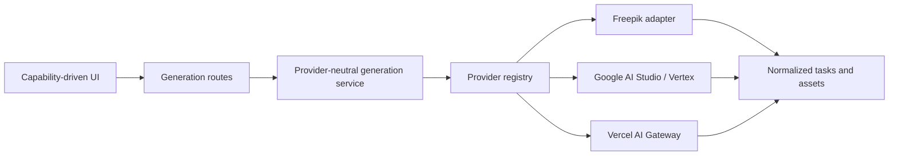

<div align="center">
  
  <h1>Open-Higgsfield</h1>
  <p><strong>The open-source Higgsfield alternative for AI image and video generation.</strong></p>
  <p>Generate with Freepik, Gemini, Google Vertex AI and Vercel AI Gateway models from one fast, provider-neutral studio.</p>

  <p>
    <a href="https://open-higgsfield.techbe.me"><strong>Live Demo</strong></a>
    |
    <a href="#quick-start">Quick Start</a>
    |
    <a href="docs/providers.md">Providers</a>
    |
    <a href="CONTRIBUTING.md">Contribute</a>
  </p>

  <p>
    <a href="https://github.com/TechBeme/open-higgsfield/actions/workflows/ci.yml"></a>
    <a href="LICENSE"></a>
    <a href="https://nextjs.org"></a>
    <a href="https://www.typescriptlang.org"></a>
    <a href="https://github.com/TechBeme/open-higgsfield/stargazers"></a>
  </p>

  <p><a href="docs/README.pt-BR.md">Leia em Portugues</a></p>
</div>


## The open-source Higgsfield alternative

Open-Higgsfield is a free, self-hostable AI image and video studio for people who want a flexible alternative to closed creative platforms. Bring your own API keys, switch providers without changing tools and keep the interface, model catalog and deployment under your control.

AI media APIs use different model names, payloads, upload rules, polling formats and output types. Open-Higgsfield puts those differences behind one normalized architecture, so creators get one consistent studio and developers get one extensible codebase.

Open-Higgsfield currently exposes **40 curated image and video models** across four provider integrations without coupling the UI to any provider SDK.

> Open-Higgsfield is an independent open-source project and is not affiliated with or endorsed by Higgsfield AI.

## Highlights

- **Images and videos in one studio** - switch modes without leaving the workspace.
- **Multi-provider by design** - Freepik, Google AI Studio, Vertex AI and Vercel AI Gateway.
- **40 curated models** - including Gemini, Veo, Flux, Seedream, Kling, Wan, Runway, LTX and more.
- **Text-to-media and reference workflows** - image-to-image, image-to-video, start/end frames, video and audio inputs.
- **Capability-driven controls** - the UI only shows settings supported by the selected model.
- **Provider-neutral tasks** - consistent submission, polling, errors and generated asset handling.
- **Responsive command bar** - a focused desktop and mobile experience with drag-and-drop media.
- **Internationalized** - English and Brazilian Portuguese included.
- **Self-hostable** - run with Node.js or Docker and bring your own API keys.

## Supported providers

| Provider | Images | Videos | Authentication |
| --- | ---: | ---: | --- |
| Freepik | 7 | 16 | `FREEPIK_API_KEY` |
| Google AI Studio | 3 | 1 | `GEMINI_API_KEY` |
| Google Vertex AI | 2 | 1 | Google Cloud credentials |
| Vercel AI Gateway | 5 | 5 | `AI_GATEWAY_API_KEY` |

The model catalog includes Gemini Image, Veo, Flux, Recraft, GPT Image, Kling, Wan, Runway, Seedance, Seedream, PixVerse, LTX, MiniMax and OmniHuman. Availability and pricing are controlled by each upstream provider.

See the complete integration guide in [docs/providers.md](docs/providers.md).

## Screenshots

| Model discovery | Adaptive controls |
| --- | --- |
|  |  |

## Quick start

### Requirements

- Node.js 22+
- npm 10+
- At least one provider API key
- Cloudinary credentials for workflows that upload reference media

### Run locally

```bash
git clone https://github.com/TechBeme/open-higgsfield.git
cd open-higgsfield
npm install
cp .env.example .env.local
npm run dev
```

Open [http://localhost:3000](http://localhost:3000). Configure only the provider you want to use.

### Run with Docker

```bash
cp .env.example .env.local
docker compose up --build
```

Generated files and local task history are stored in the `open-higgsfield-data` Docker volume.

## Configuration

```dotenv
# Freepik
FREEPIK_API_KEY=

# Google AI Studio
GEMINI_API_KEY=

# Google Vertex AI
GOOGLE_CLOUD_PROJECT=
GOOGLE_CLOUD_LOCATION=global
GOOGLE_SERVICE_ACCOUNT_JSON=

# Vercel AI Gateway
AI_GATEWAY_API_KEY=

# Reference media uploads
CLOUDINARY_URL=
```

Never prefix provider secrets with `NEXT_PUBLIC_`. Open-Higgsfield reads credentials only in server-side modules. See [.env.example](.env.example) for every supported variable.

## How it works



The frontend reads model capabilities from `src/models/capabilities`. The backend resolves the selected provider through `src/providers/registry.ts`. Every provider implements the same submission and polling contract from `src/providers/types.ts`.

This separation lets you add a provider without rewriting the command bar, task feed or persistence format.

- [Architecture overview](docs/architecture.md)
- [Add or configure providers](docs/providers.md)
- [Deployment guide](docs/deployment.md)

## Add a provider

1. Add a provider ID and implement `GenerationProvider` in `src/providers/`.
2. Register the implementation in `src/providers/registry.ts`.
3. Describe each model in `src/models/capabilities/`.
4. Add documented environment variables to `.env.example`.

The UI automatically derives model groups, media slots and controls from capabilities.

## Deploy

[](https://vercel.com/new/clone?repository-url=https%3A%2F%2Fgithub.com%2FTechBeme%2Fopen-higgsfield)

Open-Higgsfield can be deployed to Vercel for a public interface, but local files and in-memory tasks are ephemeral on serverless platforms. For reliable production generation, connect durable object storage and a persistent task/queue backend. The Docker deployment keeps local state on a volume and is the simplest full-featured self-hosted option today.

Read [docs/deployment.md](docs/deployment.md) before exposing a deployment that uses paid provider credentials.

## Security

- Secrets stay server-side and all local environment files are ignored.
- User-supplied remote media URLs are validated to block private-network access.
- Generation payloads, prompts and file names are not written to debug logs.
- Public deployments should add authentication, rate limits and provider spend limits.

Please report vulnerabilities privately as described in [SECURITY.md](SECURITY.md).

## Project status and roadmap

Open-Higgsfield is actively evolving. The provider abstraction and generation studio are usable now; production infrastructure depends on the deployment target.

- [x] Multi-provider image and video generation
- [x] Capability-driven model controls
- [x] Provider-neutral async polling
- [x] Responsive UI and i18n
- [x] Docker deployment
- [ ] Durable storage adapters for serverless deployments
- [ ] Authentication and configurable rate limiting
- [ ] Provider health and cost visibility
- [ ] Community model presets

## Contributing

Contributions are welcome. Start with [CONTRIBUTING.md](CONTRIBUTING.md), browse [good first issues](https://github.com/TechBeme/open-higgsfield/labels/good%20first%20issue), or open a discussion with a provider/model proposal.

If Open-Higgsfield is useful to you, **star the repository**. Stars help more builders discover the project and directly influence what gets prioritized next.

## License

Open-Higgsfield is released under the [MIT License](LICENSE).

---

<div align="center">
  Built by <a href="https://techbe.me">TechBe</a> for creators and open-source AI builders.
</div>
