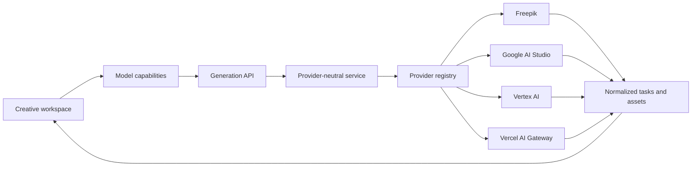

<div align="center">
  

  # Open-Higgsfield

  **The open-source, multi-provider alternative to Higgsfield for AI image and video generation.**

  Generate with Freepik, Gemini, Google Vertex AI, and Vercel AI Gateway models from one focused creative studio.

  <p>
    <a href="https://openhiggs.techbe.me"><strong>Live Demo</strong></a>
    |
    <a href="#why-open-higgsfield">Features</a>
    |
    <a href="#supported-providers">Providers</a>
    |
    <a href="#quick-start">Quick Start</a>
    |
    <a href="CONTRIBUTING.md">Contribute</a>
  </p>

  <p>
    <a href="https://github.com/TechBeme/open-higgsfield/actions/workflows/ci.yml"></a>
    <a href="LICENSE"></a>
    <a href="https://nextjs.org"></a>
    <a href="https://www.typescriptlang.org"></a>
    <a href="https://github.com/TechBeme/open-higgsfield/stargazers"></a>
  </p>

  **Languages:** 🇺🇸 English · [🇧🇷 Português](README.pt-BR.md) · [🇪🇸 Español](README.es.md)

  <p>
    <a href="https://vercel.com/new/clone?repository-url=https%3A%2F%2Fgithub.com%2FTechBeme%2Fopen-higgsfield"></a>
  </p>
</div>


## Why Open-Higgsfield?

AI media models are spread across providers, dashboards, payload formats, and incompatible controls. Open-Higgsfield brings them into one fast visual workspace:

- **Generate images and videos in the same studio** without switching products.
- **Choose from 40 curated models** across Freepik, Google AI Studio, Vertex AI, and Vercel AI Gateway.
- **Use the right controls for every model** with capability-driven aspect ratios, resolutions, duration, seed, CFG, safety, and audio options.
- **Work with references naturally** through image-to-image, image-to-video, start/end frames, video, and audio inputs.
- **Switch providers without relearning the interface** because tasks, progress, errors, and outputs use one consistent workflow.
- **Bring your own API keys and own the stack** with an MIT-licensed, self-hostable Next.js application.

## Screenshots

| Model discovery | Adaptive controls |
| --- | --- |
|  |  |

### Unified generation workspace


## Supported providers

| Provider | Images | Videos | Authentication |
| --- | ---: | ---: | --- |
| Freepik | 7 | 16 | `FREEPIK_API_KEY` |
| Google AI Studio | 3 | 1 | `GEMINI_API_KEY` |
| Google Vertex AI | 2 | 1 | Google Cloud credentials |
| Vercel AI Gateway | 5 | 5 | `AI_GATEWAY_API_KEY` |

The catalog includes Gemini Image, Veo, Flux, Recraft, GPT Image, Kling, Wan, Runway, Seedance, Seedream, PixVerse, LTX, MiniMax, Z-Image, and OmniHuman. Model availability, pricing, quotas, and preview access are controlled by each upstream provider.

See [Providers and models](docs/providers.md) for credentials, provider behavior, and extension instructions.

## Features

- Prompt-to-image and prompt-to-video generation
- Image-to-image and image-to-video workflows
- Start frame, end frame, character, motion, video, and audio references
- Model-aware aspect ratio, size, resolution, duration, seed, CFG, style, and safety controls
- Native audio and multi-shot options where supported
- Drag-and-drop, paste, upload, and public URL inputs
- Normalized synchronous and asynchronous generation tasks
- Live progress, reusable prompts, previews, and downloads
- Responsive desktop and mobile command interface
- Interface in English and Brazilian Portuguese
- Server-only provider credentials
- Local Node.js, Docker, and Vercel deployment support

## Tech stack

[](https://nextjs.org/)
[](https://react.dev/)
[](https://www.typescriptlang.org/)
[](https://tailwindcss.com/)
[](https://vercel.com/)

- Next.js App Router and server route handlers
- React 19, strict TypeScript, Tailwind CSS 4, and Framer Motion
- Capability-driven model catalog and provider-neutral generation contracts
- Freepik API, Google Gen AI SDK, Vertex AI, and Vercel AI Gateway
- Cloudinary handoff for workflows that require public reference-media URLs
- Local filesystem task storage with replaceable persistence boundaries

## Architecture



The UI reads model capabilities instead of provider-specific rules. The backend converts every request into canonical generation parameters, resolves the provider adapter, and normalizes synchronous results or asynchronous operations into the same task format.

See [Architecture](docs/architecture.md) for the complete request lifecycle and extension points.

## Quick start

### Prerequisites

- Node.js 22+
- npm 10+
- At least one supported provider credential
- Cloudinary credentials only when a workflow requires public reference-media URLs

### 1. Clone and install

```bash
git clone https://github.com/TechBeme/open-higgsfield.git
cd open-higgsfield
npm install
```

### 2. Configure the environment

```bash
cp .env.example .env.local
```

Configure only the providers you want to use:

```dotenv
# Freepik
FREEPIK_API_KEY=

# Google AI Studio
GEMINI_API_KEY=

# Google Vertex AI
GOOGLE_CLOUD_PROJECT=
GOOGLE_CLOUD_LOCATION=global
GOOGLE_SERVICE_ACCOUNT_JSON=

# Vercel AI Gateway
AI_GATEWAY_API_KEY=

# Reference-media uploads
CLOUDINARY_URL=
```

Never use `NEXT_PUBLIC_` for provider credentials. Open-Higgsfield reads them only from server-side modules.

### 3. Start Open-Higgsfield

```bash
npm run dev
```

Open [http://localhost:3000](http://localhost:3000) and start generating.

### Docker

```bash
cp .env.example .env.local
docker compose up --build
```

Docker stores generated files and task history in the `open-higgsfield-data` volume.

## Deploy on Vercel

Use the **Deploy with Vercel** button at the top, then add credentials only for the providers you want enabled. Attach a custom domain after the first successful deployment.

Vercel uses ephemeral `/tmp` storage. The interface and generation routes work normally, but durable task history and generated files require shared object storage and a persistent task backend. Docker remains the simplest full-state self-hosted deployment.

> [!WARNING]
> Open-Higgsfield does not currently include built-in authentication, rate limiting, or per-user spending limits. Protect public deployments connected to billable provider accounts.

See [Deployment](docs/deployment.md) for production and persistence guidance.

## Commands

| Command | Purpose |
| --- | --- |
| `npm run dev` | Start the development server |
| `npm run lint` | Run ESLint |
| `npm run typecheck` | Run TypeScript checks |
| `npm run build` | Create a production build |
| `npm run check` | Run lint, typecheck, and build |
| `npm start` | Serve the production build |

## Documentation

- [Providers and models](docs/providers.md): credentials, supported integrations, and adding providers
- [Architecture](docs/architecture.md): capability system, provider registry, tasks, and storage
- [Deployment](docs/deployment.md): Vercel, Docker, Node.js, security, and persistence
- [Contributing](CONTRIBUTING.md): development workflow and pull requests
- [Security policy](SECURITY.md): responsible vulnerability reporting

## Contributing

Contributions are welcome, from new providers and model families to accessibility, translations, tests, and creative tooling.

1. Read [CONTRIBUTING.md](CONTRIBUTING.md).
2. Fork the repository and create a focused branch.
3. Run `npm run check`.
4. Open a pull request using the provided template.

If Open-Higgsfield is useful to you, **star the repository**, share it with another creator, and show us what you build.

## Security

Do not report vulnerabilities in public issues. Follow [SECURITY.md](SECURITY.md) and never include provider credentials, private generated media, or personal data in reports.

## Disclaimer

Open-Higgsfield is an independent open-source project. It is not affiliated with, endorsed by, or sponsored by Higgsfield AI, Freepik, Google, Vercel, or any model provider. Product and model names belong to their respective owners. Availability, pricing, quotas, APIs, and capabilities may change upstream.

You are responsible for provider costs, generated content, deployment security, and compliance with provider terms and applicable law.

## License

Released under the [MIT License](LICENSE).

---

<div align="center">

**Developed by [Rafael Vieira](https://github.com/TechBeme)**

[](https://github.com/TechBeme)
[](https://www.fiverr.com/tech_be)
[](https://www.upwork.com/freelancers/~01f0abcf70bbd95376)
[](mailto:contact@techbe.me)

</div>
