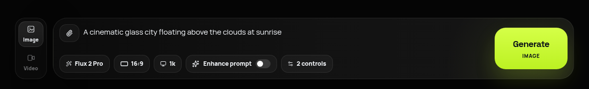
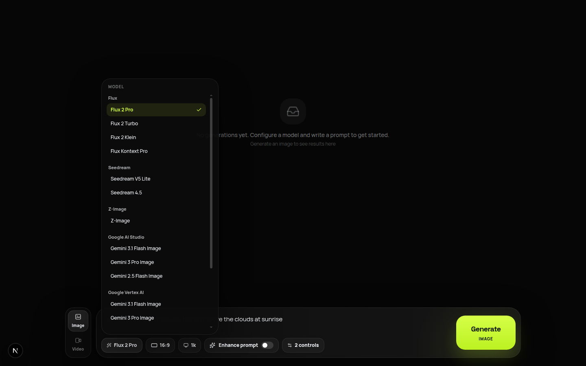
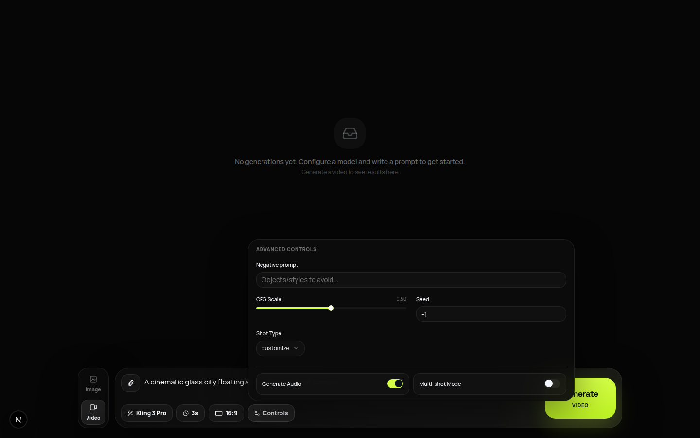
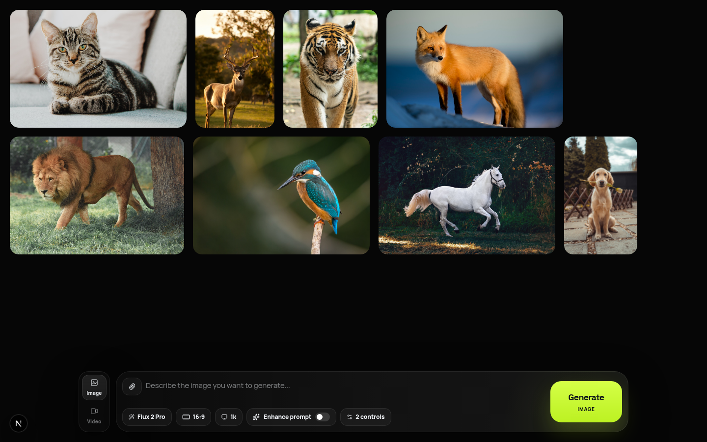
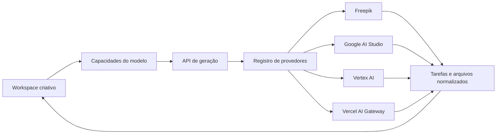

<div align="center">
  

  # Open-Higgsfield

  **A alternativa open source e multiprovedor ao Higgsfield para gerar imagens e vídeos com IA.**

  Gere com modelos da Freepik, Gemini, Google Vertex AI e Vercel AI Gateway em um único estúdio criativo.

  <p>
    <a href="https://openhiggs.techbe.me"><strong>Demo ao vivo</strong></a>
    |
    <a href="#por-que-open-higgsfield">Recursos</a>
    |
    <a href="#provedores-suportados">Provedores</a>
    |
    <a href="#início-rápido">Início rápido</a>
    |
    <a href="CONTRIBUTING.md">Contribuir</a>
  </p>

  <p>
    <a href="https://github.com/TechBeme/open-higgsfield/actions/workflows/ci.yml"></a>
    <a href="LICENSE"></a>
    <a href="https://nextjs.org"></a>
    <a href="https://www.typescriptlang.org"></a>
    <a href="https://github.com/TechBeme/open-higgsfield/stargazers"></a>
  </p>

  **Idiomas:** [🇺🇸 English](README.md) · 🇧🇷 Português · [🇪🇸 Español](README.es.md)

  <p>
    <a href="https://vercel.com/new/clone?repository-url=https%3A%2F%2Fgithub.com%2FTechBeme%2Fopen-higgsfield"></a>
  </p>
</div>



## Por que Open-Higgsfield?

Modelos de mídia generativa estão espalhados entre provedores, painéis e controles incompatíveis. O Open-Higgsfield reúne tudo em um único workspace visual:

- **Gere imagens e vídeos no mesmo estúdio** sem trocar de produto.
- **Escolha entre 40 modelos selecionados** da Freepik, Google AI Studio, Vertex AI e Vercel AI Gateway.
- **Use os controles certos para cada modelo**: proporção, resolução, duração, seed, CFG, segurança e áudio.
- **Trabalhe com referências naturalmente** em fluxos image-to-image, image-to-video, primeiro/último frame, vídeo e áudio.
- **Troque de provedor sem reaprender a interface** com tarefas, progresso, erros e resultados normalizados.
- **Use suas próprias chaves e controle a stack** com uma aplicação Next.js MIT e self-hostable.

## Capturas de tela

| Descoberta de modelos | Controles adaptativos |
| --- | --- |
|  |  |

### Workspace unificado de geração



## Provedores suportados

| Provedor | Imagens | Vídeos | Autenticação |
| --- | ---: | ---: | --- |
| Freepik | 7 | 16 | `FREEPIK_API_KEY` |
| Google AI Studio | 3 | 1 | `GEMINI_API_KEY` |
| Google Vertex AI | 2 | 1 | Credenciais do Google Cloud |
| Vercel AI Gateway | 5 | 5 | `AI_GATEWAY_API_KEY` |

O catálogo inclui Gemini Image, Veo, Flux, Recraft, GPT Image, Kling, Wan, Runway, Seedance, Seedream, PixVerse, LTX, MiniMax, Z-Image e OmniHuman. Disponibilidade, preço, cotas e acesso preview são controlados por cada provedor.

Veja [Provedores e modelos](docs/providers.md) para credenciais e instruções de extensão.

## Recursos

- Geração prompt-to-image e prompt-to-video
- Fluxos image-to-image e image-to-video
- Referências de primeiro frame, último frame, personagem, movimento, vídeo e áudio
- Controles de proporção, tamanho, resolução, duração, seed, CFG, estilo e segurança por modelo
- Áudio nativo e múltiplas cenas quando suportados
- Entradas por arrastar e soltar, colar, upload e URL pública
- Tarefas síncronas e assíncronas normalizadas
- Progresso ao vivo, reutilização de prompts, preview e download
- Interface responsiva para desktop e mobile
- Credenciais disponíveis somente no servidor
- Deploy local, Docker e Vercel

## Stack técnica

[](https://nextjs.org/)
[](https://react.dev/)
[](https://www.typescriptlang.org/)
[](https://tailwindcss.com/)
[](https://vercel.com/)

Next.js App Router, React 19, TypeScript strict, Tailwind CSS 4, Framer Motion, Freepik API, Google Gen AI SDK, Vertex AI e Vercel AI Gateway.

## Arquitetura



A interface lê as capacidades dos modelos. O backend converte cada solicitação em parâmetros canônicos, resolve o adaptador e normaliza resultados síncronos ou operações assíncronas no mesmo formato de tarefa. Veja [Arquitetura](docs/architecture.md).

## Início rápido

### Pré-requisitos

- Node.js 22+
- npm 10+
- Credencial de pelo menos um provedor
- Cloudinary apenas para fluxos que exigem URLs públicas de referência

```bash
git clone https://github.com/TechBeme/open-higgsfield.git
cd open-higgsfield
npm install
cp .env.example .env.local
npm run dev
```

Configure somente os provedores que deseja usar:

```dotenv
FREEPIK_API_KEY=
GEMINI_API_KEY=
GOOGLE_CLOUD_PROJECT=
GOOGLE_CLOUD_LOCATION=global
GOOGLE_SERVICE_ACCOUNT_JSON=
AI_GATEWAY_API_KEY=
CLOUDINARY_URL=
```

Abra [http://localhost:3000](http://localhost:3000). Nunca use `NEXT_PUBLIC_` em credenciais de provedores.

### Docker

```bash
cp .env.example .env.local
docker compose up --build
```

## Deploy na Vercel

Use o botão **Deploy with Vercel** no topo e adicione somente as credenciais dos provedores desejados. Configure `DATABASE_URL` para persistir o histórico e as imagens geradas no PostgreSQL/Neon. Uploads temporários, vídeos e workers assíncronos ainda exigem object storage e filas duráveis. Veja [Deploy](docs/deployment.md).

> [!WARNING]
> O Open-Higgsfield não possui autenticação, rate limiting ou limites de gasto por usuário integrados. Proteja deployments públicos conectados a contas faturáveis.

## Comandos

| Comando | Finalidade |
| --- | --- |
| `npm run dev` | Inicia o servidor de desenvolvimento |
| `npm run lint` | Executa o ESLint |
| `npm run typecheck` | Verifica o TypeScript |
| `npm run build` | Cria o build de produção |
| `npm run check` | Executa lint, typecheck e build |
| `npm start` | Serve o build de produção |

## Documentação

- [Provedores e modelos](docs/providers.md)
- [Arquitetura](docs/architecture.md)
- [Deploy](docs/deployment.md)
- [Como contribuir](CONTRIBUTING.md)
- [Política de segurança](SECURITY.md)

## Como contribuir

Leia [CONTRIBUTING.md](CONTRIBUTING.md), crie uma branch focada, execute `npm run check` e abra um pull request. Se o projeto for útil, **dê uma estrela no repositório** e compartilhe o que você construiu.

## Segurança e aviso legal

Não relate vulnerabilidades em issues públicas. Open-Higgsfield é independente e não é afiliado à Higgsfield AI, Freepik, Google, Vercel ou provedores de modelos. Você é responsável por custos, conteúdo gerado, segurança e conformidade.

## Licença

Distribuído sob a [Licença MIT](LICENSE).

---

<div align="center">

**Developed by [Rafael Vieira](https://github.com/TechBeme)**

[](https://github.com/TechBeme)
[](https://www.fiverr.com/tech_be)
[](https://www.upwork.com/freelancers/~01f0abcf70bbd95376)
[](mailto:contact@techbe.me)

</div>
