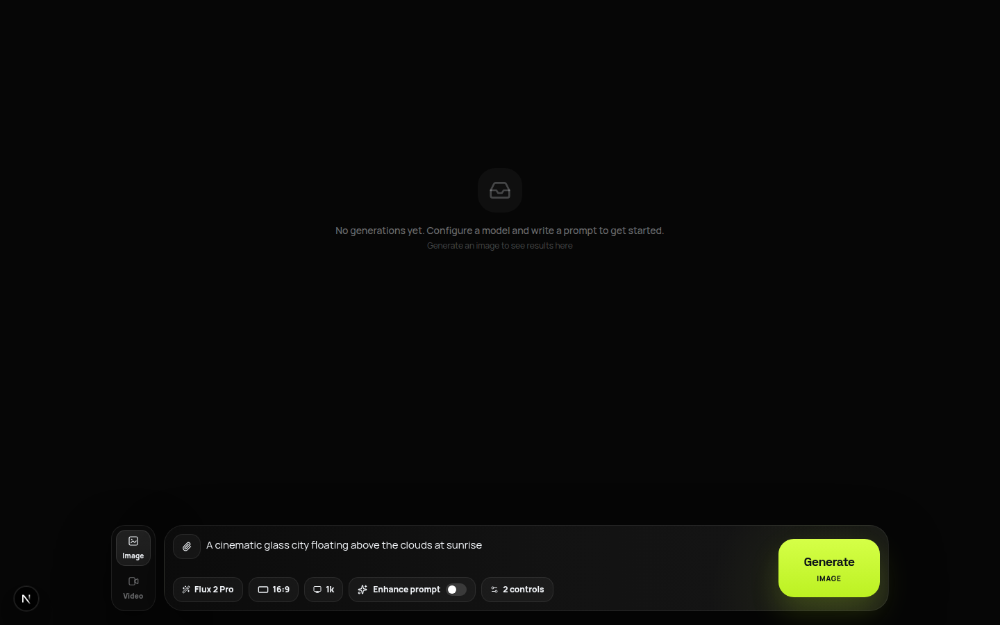

# Flow

O Flow e um studio open source para gerar imagens e videos com IA usando varios provedores em uma unica interface.

[Demo](https://flow.techbe.me) | [README principal](../README.md) | [Como contribuir](../CONTRIBUTING.md)



## O que o projeto resolve

Cada API de geracao usa modelos, payloads, uploads, polling e formatos de resposta diferentes. O Flow normaliza essas diferencas em uma arquitetura modular:

- uma interface consistente para imagem e video;
- controles que se adaptam ao modelo selecionado;
- providers isolados do frontend;
- tarefas e resultados com um contrato unico;
- suporte a texto, imagens de referencia, video e audio.

## Providers

| Provider | Imagens | Videos |
| --- | ---: | ---: |
| Freepik | 7 | 16 |
| Google AI Studio | 3 | 1 |
| Google Vertex AI | 2 | 1 |
| Vercel AI Gateway | 5 | 5 |

O catalogo inclui Gemini, Veo, Flux, Recraft, GPT Image, Kling, Wan, Runway, Seedance, Seedream, PixVerse, LTX, MiniMax e OmniHuman.

## Inicio rapido

```bash
git clone https://github.com/TechBeme/flow-ai-studio.git
cd flow-ai-studio
npm install
cp .env.example .env.local
npm run dev
```

Abra `http://localhost:3000`. Voce precisa configurar apenas o provider que pretende usar.

## Docker

```bash
cp .env.example .env.local
docker compose up --build
```

## Seguranca

Nunca coloque chaves em variaveis `NEXT_PUBLIC_*`. Em uma demo publica, adicione autenticacao, rate limit e limites de gasto no provider. Leia [SECURITY.md](../SECURITY.md) e o [guia de deploy](deployment.md).

## Contribua

Pull requests, novos providers, modelos e melhorias de UX sao bem-vindos. Leia [CONTRIBUTING.md](../CONTRIBUTING.md). Se o projeto for util, deixe uma estrela para ajudar outras pessoas a encontra-lo.
